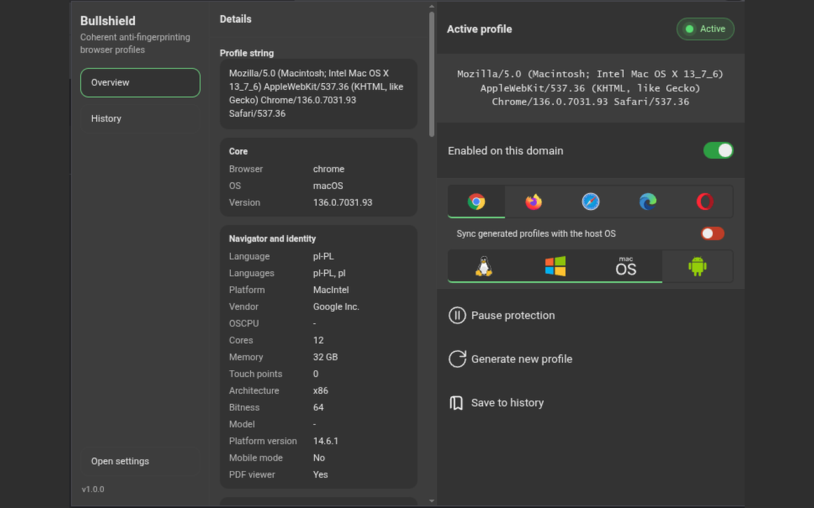

# Bullshield - User-Agent & Fingerprint Spoofer

<table>
  <tr>
    <td width="220" valign="top" align="center">
      
    </td>
    <td valign="top">
      <strong>Coherent anti-fingerprinting for Chromium-based browsers.</strong>
      <br /><br />
      Bullshield aligns browser-visible identity surfaces across request headers, JavaScript APIs, rendering paths, locale, timezone, worker execution, and early browser-level overrides.
    </td>
  </tr>
</table>

<p align="center">
  <strong>Video demo:</strong>
  <a href="https://www.youtube.com/watch?v=U2T-39w7ZXY">Watch on YouTube</a>
</p>

## Overview

Bullshield is a Chromium-first anti-fingerprinting extension built to reduce browser fingerprint inconsistencies by applying one coherent generated profile across the surfaces that websites commonly compare.

It is not a simple User-Agent switcher. Changing only one visible value usually makes fingerprinting easier, not harder. Bullshield focuses on consistency between related surfaces so the browser presents one aligned profile instead of conflicting values.

## Core capabilities

Bullshield can align or control:

- request headers and Client Hints
- navigator identity and browser capability surfaces
- screen size, DPR, and CSS media query exposure
- locale and timezone behavior
- WebGL and WebGPU identity surfaces
- canvas, audio, DOMRect, text metrics, and math-related fingerprint surfaces
- fonts, media devices, PDF viewer, permissions, speech voices, battery, and WebRTC exposure
- worker-related paths and early browser-level override paths
- per-domain rules and activation state
- popup profile controls and saved profile history

## Why the extension asks for broad permissions

Anti-fingerprinting protection has to run in several contexts and at several timing layers.

Bullshield currently uses these permissions for its single purpose:

- `<all_urls>`
- `scripting`
- `declarativeNetRequest`
- `cookies`
- `webNavigation`
- `debugger`
- `storage`
- `tabs`
- `alarms`

These permissions are used to inject protection at the right time, align outgoing request data, prepare page-side payload handoff before site scripts execute, manage per-site state, and keep the active profile available across the extension runtime.


## User interface

Bullshield includes:

- first-run onboarding with permission disclosure
- a popup with the active generated profile, current domain state, and quick actions
- dedicated settings areas for general behavior, fingerprint controls, and profile generation

The popup overview used in the repository preview is shown above and matches the current project UI.

<p align="center">
  
</p>

## Local-first privacy model

Bullshield is designed to operate locally inside the browser extension runtime.

It stores extension state such as:

- settings
- onboarding state
- the active generated profile
- user-saved profile history

Bullshield does not require an account for its core runtime.

## Diagnostic test posture

Bullshield is designed to reduce inconsistencies commonly highlighted by fingerprinting diagnostics such as CreepJS by keeping correlated surfaces aligned instead of spoofing one value in isolation.

That does not justify claiming that the extension is universally undetectable. Observed results still depend on the selected settings, browser build, operating system, enabled extensions, and the test methodology.

## Repository structure

```text
src/                          source code
static/                       packaged static assets and icons
.github/workflows/            CI and release automation
docs/chrome-web-store/        store listing, privacy, reviewer, and asset docs
docs/legal/                   privacy policy and attribution
docs/repo/                    repository and release notes
```

## Development

Expected local environment:

- Node `24.14.0`
- npm `>=10`

Install and validate:

```bash
npm ci
npm run lint
npm run test
npm run build
```

## Build outputs

Production builds are written to:

- `dist/chrome/`
- `dist/firefox/`
- `dist/chrome.zip`
- `dist/firefox.zip`

The packaged extension version is read from `package.json`, so release tags should match the package version.

## Project links

- Repository: `https://github.com/jarczakpawel/bullshield-browser`
- Issues: `https://github.com/jarczakpawel/bullshield-browser/issues`
- Privacy policy: `docs/legal/privacy-policy.md`

## License

MIT
